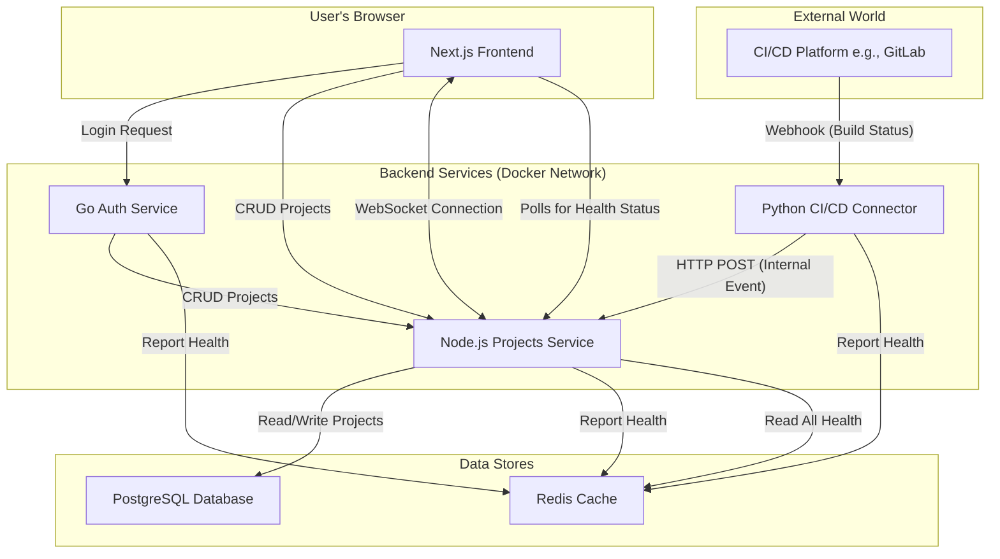

# Atlas - The Developer's Command Center

Atlas is a full-stack, polyglot microservice application designed to be a self-hostable command center for developers. It centralizes project management, service health monitoring, and real-time CI/CD activity, demonstrating a modern, production-ready architecture.

**Live Demo:** [Link to your deployed app]
**Login:** `dandi@atlas.dev` / `password123`

---

## Features

-   **Secure Authentication:** JWT-based authentication handled by a dedicated Go microservice.
-   **Project Management:** CRUD functionality for managing development projects.
-   **Live Service Health:** Real-time dashboard showing the status of all running microservices, powered by Redis.
-   **Real-time Activity Feed:** A live feed of CI/CD events (e.g., build success/failure) pushed from a Python connector via WebSockets.
-   **Polyglot Architecture:** Backend services written in Go, Node.js (TypeScript), and Python to showcase language diversity.
-   **Containerized Environment:** Fully containerized with Docker and orchestrated with Docker Compose for easy setup and deployment.
-   **Resilient & Scalable:** Services include health checks and resilient database connection logic.

---

## Architecture Diagram

This diagram illustrates the flow of information between the user, the frontend, the various microservices, and the data stores.



---

## Tech Stack

| Category      | Technology                                    |
|---------------|-----------------------------------------------|
| **Frontend**  | Next.js 14 (App Router), React, TypeScript    |
|               | Tailwind CSS, shadcn/ui                       |
|               | TanStack Query (React Query), Zustand, NextAuth.js |
| **Backend**   | Go (Gin), Node.js (Fastify), Python (Flask)   |
| **Databases** | PostgreSQL, Redis                             |
| **DevOps**    | Docker, Docker Compose, CI/CD (GitHub Actions)|
| **Testing**   | Jest, React Testing Library, Playwright       |


---

## Getting Started

### Prerequisites
- Docker & Docker Compose
- Node.js & pnpm
- A `git` client

### Local Setup

1.  **Clone the repository:**
    ```bash
    git clone https://github.com/your-username/atlas-dashboard.git
    cd atlas-dashboard
    ```

2.  **Create your local environment file:**
    ```bash
    cp .env.example .env
    ```

3.  **Configure your environment:**
    Open the `.env` file and fill in the required variables. You **must** generate a new `AUTH_SECRET`.

4.  **Run the application:**
    ```bash
    docker-compose up --build
    ```
    The application will be available at `http://localhost:3000`.

5.  **Initialize the database schema:**
    In a new terminal, run the following command to connect to the database and create the `projects` table.
    ```bash
    docker-compose exec postgres-db psql -U atlas_user -d atlas_db -c "CREATE TABLE projects (id SERIAL PRIMARY KEY, name VARCHAR(255) NOT NULL, repository_url VARCHAR(255), created_at TIMESTAMP WITH TIME ZONE DEFAULT CURRENT_TIMESTAMP);"
    ```

---

## Simulating Events

You can test the real-time activity feed by simulating a webhook from a CI/CD platform using `curl`.

```bash
# Simulate a successful build
curl -X POST -H "Content-Type: application/json" \
-d '{"projectName": "Atlas Frontend", "status": "success", "commitMessage": "feat: new dashboard", "timestamp": "'$(date -u +"%Y-%m-%dT%H:%M:%SZ")'"}' \
http://localhost:8082/api/v1/hooks/generic
```